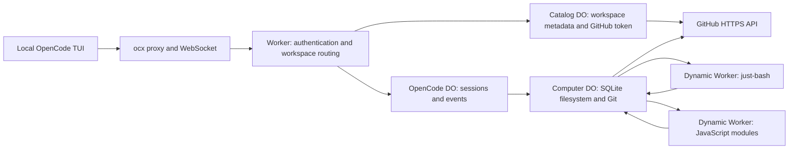

# Remote workspaces in Workers and Durable Objects

Updated September 8, 2026.

The goal is to support as much repository work as possible using Workers, Durable Objects, and V8. Containers and Cloudflare Sandboxes are excluded from this version. The local TUI displays the conversation; repository files, Git operations, shell interpretation, and JavaScript execution live on Cloudflare. No local checkout, device MCP, or Docker is required.

## Current architecture



Computer 0.2.1 supplies the durable filesystem and JavaScript Git implementation. Its `worker-shell` backend uses just-bash. Its `worker-javascript` backend runs ES modules in a separate V8 isolate. Both access the same DO filesystem, so shell commands, agent file tools, and JavaScript tasks see each other's completed writes. There is no container filesystem to synchronize.

Wrangler configures a Worker Loader binding and three SQLite DO classes. `RemoteComputer` is an ordinary Durable Object. The repository has no container configuration or Dockerfile. A future native execution backend would be an explicit optional addition.

## What you can do

| Capability | Current behavior |
| --- | --- |
| Workspaces | Clone public or authorized GitHub repositories, select a base branch, list checkouts, retry failed clones, and reattach by ID |
| Persistent files | Agent read, write, edit, find, and grep tools; TUI file listing, reads, and completion use the remote checkout |
| Shell | just-bash commands, pipelines, redirection, variables, loops, scripts, and text transforms |
| Optional commands | `curl`, `jq`, `yq`, `xan`, `file`, and `html-to-markdown` |
| Git | Computer's supported commands, including status, diff, add, commit, branch, checkout, log, and merge; HTTPS clone and brokered authenticated fetch/push |
| JavaScript | ES modules, durable relative JS imports, async `node:fs/promises`, `fetch`, console output, returned JSON, and assertions implemented by throwing |
| User commands | `/remote-shell`, `/remote-js`, and `/remote-changes` |
| Execution lifecycle | Poll output and terminal status; request cancellation; enforce execution timeouts; retain completed output in DO storage |

These are not native Bash, Git, or Node installations. Git subcommands and flags follow Computer's implementation. Shell output arrives when the command completes; JavaScript console output can arrive during execution. An interrupted command does not undo completed writes.

Native binaries, `node`/`bun` CLIs, package installation, arbitrary npm imports, Python, browser automation, PTYs, and background dev servers are unavailable. A project check that requires those capabilities must be reported as unavailable. The agent should use compatible shell checks or small JavaScript tests when they meaningfully verify its changes, and explain what remains untested.

Optional Python, SQLite, and `js-exec` shell bundles are not enabled. Their Node/Wasm runtime dependencies are not a verified workerd execution path. JavaScript uses Computer's dedicated Worker backend instead.

## Using the TUI

1. Start `ocx` with the server's `OPENCODE_PASSWORD`.
2. Use `/workspaces` to enter a GitHub repository and optional base branch. Public repositories do not require GitHub authentication.
3. For private repositories or publishing, use `/github`. It asks for the local path to a file containing a GitHub token. Only the path appears in the dialog. The launcher reads the token and sends it to the authenticated server, which validates the account before saving it in the catalog DO.
4. Attaching a workspace restarts the TUI against that workspace's OpenCode DO. The checkout is `/workspace/repo`. Each workspace has its own conversation database.
5. Ask the agent to inspect, edit, and verify code. Use `/remote-shell` or `/remote-js` to run your own checks in the same checkout. `/remote-changes` shows Git status and working-tree diffs.

Use a token with access to the intended repositories. Invalid replacement credentials leave the previous connection intact. Tokens stay outside model transcripts, shell environments, and checkout files. The agent uses `remote_git` for authenticated fetch/push; local Git commits use the shell. The current server is single-owner and requires `OPENCODE_PASSWORD` for all requests.

Remote `gh auth login` has been removed because it required a native executable. Browser device login can be added using a project-owned OAuth client ID. It is not implemented, and the project does not borrow GitHub CLI's client ID.

## JavaScript checks

`remote_javascript` takes a `command` containing ES module source. `/remote-js` accepts the same source. Put I/O and timers inside an async default export because Workers prohibit those operations during module initialization:

```js
import fs from "node:fs/promises";
import { double } from "./src/double.js";

export default async function () {
  if (double(21) !== 42) throw new Error("double failed");
  const config = JSON.parse(await fs.readFile("./package.json", "utf8"));
  console.log("assertions passed");
  return { package: config.name };
}
```

The returned value is encoded in `RemoteRun.resultJSON`. Unknown package imports fail; this runtime does not install dependencies or reproduce Node's full API. `ws:git` exposes local Git operations, while authenticated network operations remain behind the catalog broker.

HTTP clients can call `POST /api/remote/exec?workspace=<id>` with `{ "command": "...", "backend": "worker-javascript" }`. The default backend is `worker-shell`. Poll `GET /api/remote/exec/<run-id>?workspace=<id>`, or request cancellation with `DELETE` at that URL. Only those two backend identifiers are accepted.

## Bounds and recovery

Execution defaults to a two-minute deadline and caps requested deadlines at three minutes. Each workspace admits up to four active runs, with the JavaScript backend also enforcing its own admission limits. The shell loader has a 30-second CPU limit. Captured output is bounded to 128 KiB of text characters in the wrapper; the JavaScript backend additionally bounds its output bytes. Completed writes are durable immediately.

If an execution observer restarts, an unfinished run becomes failed with an explicit warning that its command may already have run. Reconnecting does not replay it. Inspect the checkout before retrying. This is recovery reporting, not automatic continuation of an evicted process. Surviving complete agent turns across detachment and Cloudflare eviction still needs deployed validation.

Two small compatibility adaptations accompany the pinned Computer version: shell cancellation controllers are shared across RPC entrypoint instances in the same workspace isolate, and YAML's bundled CommonJS built-in loads use static Worker imports. Revalidate both when updating Computer.

## Validation

On September 8, all 23 remote tests passed against local workerd with no skips. A separate workerd restart check preserved workspace metadata, a completed execution record, and a written file. Package typechecking also passed. The interactive TUI, live private GitHub access, and deployed Cloudflare lifecycle behavior remain unverified.

Run `bun run typecheck` and `bun run build`. The build checks the full Worker bundle without Docker.

For real local workerd integration, start a separate development server with disposable storage:

```sh
bunx wrangler dev --port 8791 --var OPENCODE_PASSWORD:ocx-local-test --persist-to /tmp/ocx-worker-test
```

In another terminal:

```sh
OCX_TEST_ORIGIN=http://localhost:8791 OCX_TEST_PASSWORD=ocx-local-test bun test test/remote
```

The integration tests create public GitHub checkouts in that test server. They cover remote files, HTTP/WebSocket routing, shell and JavaScript execution, failure reporting, and cancellation. Without those environment variables, integration tests skip. Token validation uses mocked GitHub responses; live private-repository access and the interactive TUI are separate checks. Local workerd does not prove deployed eviction behavior or billing.

`remote-workspaces.html` remains a simulated UI concept. Its conversation, authorization, repository, and command results are fixtures, not execution evidence.

## References

- [Computer Worker shell backend](https://github.com/cloudflare/computer/blob/main/docs/12_worker_backend.md)
- [Computer JavaScript backend](https://github.com/cloudflare/computer/blob/main/docs/17_isolate_javascript.md)
- [Computer Git implementation](https://github.com/cloudflare/computer/blob/main/docs/13_git_interface.md)
